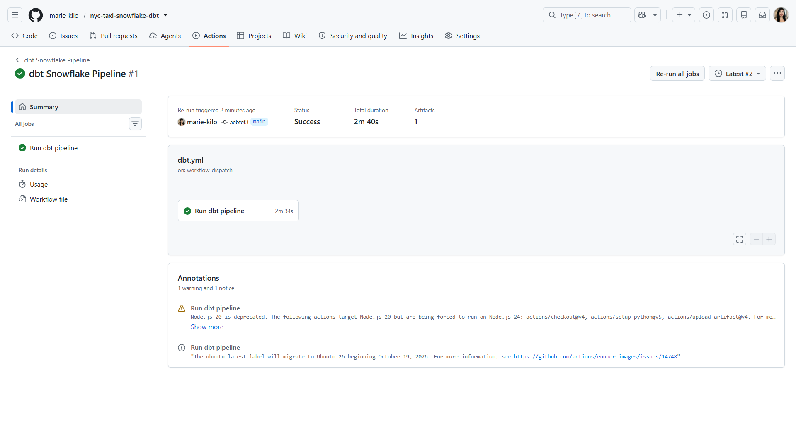
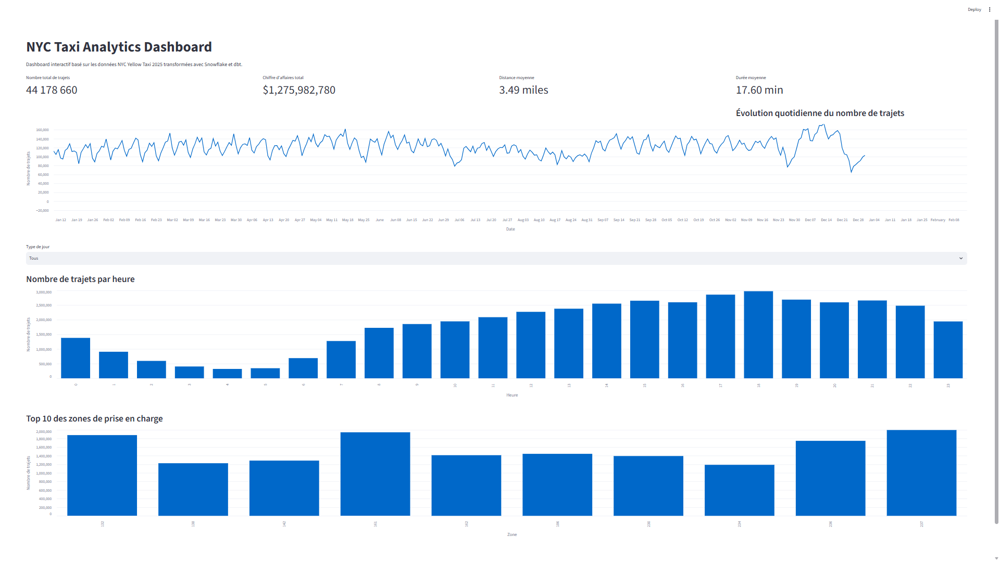

# NYC Taxi Data Warehouse — Snowflake & dbt

## Présentation du projet

Ce projet consiste à construire un pipeline Data Engineering à partir des données publiques
des taxis jaunes de New York (**NYC Yellow Taxi**).

L'objectif est d'ingérer, analyser, nettoyer, transformer et exploiter un volume important de données
afin de construire un **Data Warehouse analytique dans Snowflake**.

Le projet repose sur une architecture en trois couches :

- **RAW** : stockage des données brutes importées depuis les fichiers Parquet ;
- **STAGING** : nettoyage, filtrage et enrichissement des données ;
- **FINAL** : création de tables analytiques destinées au reporting et à la visualisation.

Les transformations sont ensuite industrialisées avec **dbt Core** afin de :

- versionner les transformations SQL ;
- gérer les dépendances entre les modèles ;
- automatiser les tests de qualité ;
- documenter les modèles et leurs colonnes ;
- générer le lineage du pipeline.

---

## Objectifs

Les principaux objectifs du projet sont :

- charger au minimum 12 mois de données NYC Yellow Taxi ;
- conserver les données brutes dans le schéma `RAW` ;
- analyser les principaux problèmes de qualité ;
- filtrer les valeurs incohérentes ou aberrantes ;
- documenter le traitement des valeurs manquantes ;
- quantifier et justifier le taux de rejet ;
- enrichir les trajets avec de nouvelles métriques ;
- produire plusieurs tables analytiques dans le schéma `FINAL` ;
- industrialiser les transformations avec dbt Core ;
- mettre en place des tests automatiques de qualité ;
- générer automatiquement la documentation dbt ;
- construire un dashboard interactif avec Streamlit à partir des tables analytiques ;
- automatiser l'exécution des transformations dbt avec GitHub Actions ;
- sécuriser les informations de connexion avec GitHub Actions Secrets.

---

## Architecture

Le Data Warehouse est organisé selon l'architecture suivante :

```text
NYC Yellow Taxi
       |
       | 12 fichiers Parquet - année 2025
       v
Snowflake Internal Stage
       |
       v
RAW.YELLOW_TAXI_TRIPS
       |
       v
dbt staging
STAGING.STG_YELLOW_TAXI_TRIPS
       |
       v
dbt intermediate
STAGING.INT_TRIP_METRICS
       |
       +---------------------------+
       |             |             |
       v             v             v
FINAL.DAILY_SUMMARY
FINAL.ZONE_ANALYSIS
FINAL.HOURLY_PATTERNS
```

---

## Couches du Data Warehouse

### RAW

Le schéma `RAW` contient les données brutes chargées depuis les fichiers Parquet.

La table principale est :

```text
RAW.YELLOW_TAXI_TRIPS
```

Les données sont conservées aussi proches que possible de leur structure source.

Aucune transformation métier n'est réalisée dans cette couche.

Le projet contient les données NYC Yellow Taxi des **12 mois de l'année 2025**.

Après ingestion :

```text
48 722 602 lignes
```

sont présentes dans la table RAW.

---

### STAGING

Le schéma `STAGING` contient les données nettoyées, filtrées et enrichies.

Les principales opérations réalisées sont :

- conversion des timestamps ;
- conservation des trajets appartenant à l'année 2025 ;
- suppression des distances nulles ou aberrantes ;
- suppression des trajets dont la durée est invalide ;
- filtrage des montants financiers négatifs ;
- conservation documentée de certaines valeurs manquantes ;
- calcul de la durée des trajets ;
- calcul de la vitesse moyenne ;
- calcul du taux de pourboire ;
- catégorisation des distances ;
- catégorisation des périodes horaires ;
- identification des jours de semaine et des week-ends.

Deux modèles dbt sont utilisés dans cette couche :

```text
STAGING.STG_YELLOW_TAXI_TRIPS
STAGING.INT_TRIP_METRICS
```

`STG_YELLOW_TAXI_TRIPS` applique principalement les règles de nettoyage et de filtrage.

`INT_TRIP_METRICS` ajoute les métriques et les catégorisations nécessaires aux analyses métier.

Après nettoyage :

```text
44 178 660 trajets
```

sont conservés.

---

### FINAL

Le schéma `FINAL` contient les tables analytiques utilisées pour calculer les KPIs et alimenter
les futurs outils de visualisation.

Trois tables principales sont créées :

```text
FINAL.DAILY_SUMMARY
FINAL.ZONE_ANALYSIS
FINAL.HOURLY_PATTERNS
```

#### `FINAL.DAILY_SUMMARY`

Cette table fournit une vue quotidienne de l'activité des taxis.

Elle contient notamment :

- le nombre total de trajets ;
- la distance moyenne ;
- la durée moyenne ;
- la vitesse moyenne ;
- le chiffre d'affaires total ;
- le revenu moyen par trajet ;
- le montant total des pourboires ;
- le taux moyen de pourboire ;
- le type de jour.

Résultat :

```text
365 lignes
```

soit une ligne par jour pour l'année 2025.

#### `FINAL.ZONE_ANALYSIS`

Cette table analyse l'activité selon la zone de prise en charge.

Elle contient notamment :

- l'identifiant de la zone de prise en charge ;
- le nombre total de trajets ;
- la distance moyenne ;
- la durée moyenne ;
- la vitesse moyenne ;
- le chiffre d'affaires total ;
- le revenu moyen par trajet ;
- le taux moyen de pourboire.

Résultat :

```text
262 zones
```

#### `FINAL.HOURLY_PATTERNS`

Cette table analyse les trajets selon :

- l'heure de prise en charge ;
- la période de la journée ;
- le type de jour.

Elle permet notamment d'étudier :

- les heures de forte activité ;
- les différences entre semaine et week-end ;
- la distance moyenne ;
- la durée moyenne ;
- la vitesse moyenne ;
- le chiffre d'affaires ;
- le revenu moyen par trajet ;
- le taux moyen de pourboire.

Résultat :

```text
48 lignes
```

correspondant aux combinaisons entre l'heure et le type de jour.

---

## Technologies utilisées

Le projet utilise les technologies suivantes :

- **Snowflake** : Data Warehouse Cloud ;
- **SQL** : analyse, nettoyage et transformation ;
- **dbt Core** : industrialisation des transformations SQL ;
- **dbt-snowflake** : connexion entre dbt et Snowflake ;
- **Python 3.12** : environnement local d'exécution ;
- **Parquet** : format des fichiers sources ;
- **Git** : gestion de versions ;
- **GitHub** : hébergement du repository et historique du projet ;
- **GitHub Actions** : orchestration automatisée du pipeline dbt ;
- **Streamlit** : création du dashboard interactif ;
- **Snowflake Connector for Python** : connexion du dashboard à Snowflake.
---

## Dataset

Les données utilisées proviennent du dataset public **NYC Yellow Taxi Trip Records** publié
par la NYC Taxi & Limousine Commission.

Le projet utilise les fichiers mensuels de l'année 2025 :

- janvier 2025 ;
- février 2025 ;
- mars 2025 ;
- avril 2025 ;
- mai 2025 ;
- juin 2025 ;
- juillet 2025 ;
- août 2025 ;
- septembre 2025 ;
- octobre 2025 ;
- novembre 2025 ;
- décembre 2025.

Les fichiers sont fournis au format **Parquet**.

Après chargement des 12 fichiers dans Snowflake :

```text
48 722 602 trajets
```

sont présents dans la couche `RAW`.

La période analytique couvre donc une année complète.

---

## Ingestion des données

### Format Parquet

Un format de fichier Snowflake est utilisé pour lire les fichiers Parquet :

```sql
CREATE OR REPLACE FILE FORMAT PARQUET_FORMAT
TYPE = PARQUET;
```

### Stage Snowflake

Le projet utilise un **stage Snowflake interne** :

```text
RAW.NYC_TAXI_STAGE
```

Les 12 fichiers Parquet sont déposés dans ce stage avant leur ingestion dans la table RAW.

Le stage interne a été retenu dans le contexte de ce projet de formation afin de travailler
directement avec l'environnement Snowflake disponible sans dépendre d'un stockage Cloud externe
supplémentaire.

Dans un contexte professionnel, un stage externe connecté par exemple à Amazon S3, Azure Blob
Storage ou Google Cloud Storage pourrait permettre d'automatiser davantage l'ingestion.

### Vérification du schéma

La structure des fichiers Parquet a été contrôlée avec `INFER_SCHEMA`.

Les 12 fichiers utilisent la même structure et aucune dérive de schéma significative n'a été
détectée.

Les timestamps de prise en charge et de dépose sont stockés sous forme de nombres correspondant
à des timestamps Unix en microsecondes.

Ils sont convertis dans Snowflake avec :

```sql
TO_TIMESTAMP_NTZ(column_name, 6)
```

---

## Qualité des données

Une analyse de qualité a été réalisée sur les données brutes avant les transformations.

Les principaux problèmes identifiés concernent :

- les dates incohérentes ;
- les distances invalides ;
- les montants négatifs ;
- les valeurs manquantes ;
- les durées incohérentes.

---

### Dates incohérentes

Certains trajets possèdent une date de prise en charge située en dehors de l'année 2025.

Nombre de lignes concernées :

```text
29 trajets
```

La règle retenue est :

```sql
TO_TIMESTAMP_NTZ(TPEP_PICKUP_DATETIME, 6) >= '2025-01-01'
AND TO_TIMESTAMP_NTZ(TPEP_PICKUP_DATETIME, 6) < '2026-01-01'
```

---

### Distances invalides

Les données contiennent notamment des trajets avec une distance égale à zéro ainsi que
des valeurs extrêmes.

Résultats observés :

- distance négative : `0` ligne ;
- distance égale à zéro : `1 402 958` lignes ;
- distance supérieure à 1000 miles : `2 037` lignes ;
- distance maximale observée : `397 994,37 miles`.

La règle retenue est :

```sql
TRIP_DISTANCE > 0
AND TRIP_DISTANCE <= 1000
```

Les trajets avec une distance égale à zéro ne permettent pas de calculer de manière pertinente
certaines métriques, notamment la vitesse moyenne.

Le seuil de 1000 miles permet d'écarter des valeurs manifestement aberrantes dans le contexte
de trajets en taxi à New York.

---

### Montants négatifs

Plusieurs colonnes financières contiennent des valeurs négatives.

Les lignes présentant au moins un montant négatif sur les variables financières contrôlées
sont rejetées.

Nombre de lignes concernées par au moins une anomalie financière :

```text
2 856 096 lignes
```

Les principales colonnes contrôlées sont :

- `FARE_AMOUNT`
- `EXTRA`
- `MTA_TAX`
- `TIP_AMOUNT`
- `TOLLS_AMOUNT`
- `IMPROVEMENT_SURCHARGE`
- `TOTAL_AMOUNT`
- `CONGESTION_SURCHARGE`
- `AIRPORT_FEE`
- `CBD_CONGESTION_FEE`

Les montants doivent être supérieurs ou égaux à zéro.

Pour certaines colonnes comme `CONGESTION_SURCHARGE` et `AIRPORT_FEE`, les valeurs `NULL`
sont autorisées.

---

### Valeurs manquantes

Des valeurs `NULL` sont présentes principalement dans les colonnes suivantes :

- `PASSENGER_COUNT`
- `RATECODEID`
- `STORE_AND_FWD_FLAG`
- `CONGESTION_SURCHARGE`
- `AIRPORT_FEE`

Nombre de lignes concernées :

```text
11 611 894 lignes
```

Ces valeurs manquantes apparaissent sur les mêmes lignes.

Ces trajets sont conservés car les colonnes concernées ne sont pas indispensables aux analyses
principales du projet.

Aucune imputation artificielle n'est réalisée afin de ne pas créer de valeurs qui n'existent pas
dans la source.

Les colonnes critiques nécessaires aux calculs principaux sont contrôlées séparément.

---

### Durées incohérentes

La durée est calculée à partir de la différence entre la date de prise en charge et la date de dépose.

Les anomalies observées sont :

- durée négative : `2 235` trajets ;
- durée égale à zéro : `544 069` trajets ;
- durée supérieure à 24 heures : `351` trajets.

Seuls les trajets dont la durée est strictement positive et inférieure ou égale à 24 heures sont
conservés.

La règle appliquée est :

```sql
DATEDIFF(
    'second',
    TO_TIMESTAMP_NTZ(TPEP_PICKUP_DATETIME, 6),
    TO_TIMESTAMP_NTZ(TPEP_DROPOFF_DATETIME, 6)
) > 0
```

et :

```sql
DATEDIFF(
    'second',
    TO_TIMESTAMP_NTZ(TPEP_PICKUP_DATETIME, 6),
    TO_TIMESTAMP_NTZ(TPEP_DROPOFF_DATETIME, 6)
) <= 86400
```

Le seuil de 24 heures permet d'écarter des durées manifestement incohérentes pour l'usage
analytique attendu.

---

## Résultat du nettoyage

Les règles de qualité sont appliquées simultanément.

| Indicateur | Valeur |
|---|---:|
| Lignes RAW | 48 722 602 |
| Lignes rejetées | 4 543 942 |
| Lignes conservées | 44 178 660 |
| Taux de rejet | 9,326148 % |
| Taux de conservation | 90,673852 % |

Après nettoyage :

```text
44 178 660 trajets valides
```

sont conservés pour les transformations et analyses.

Une même ligne peut présenter plusieurs anomalies.

Les différents volumes d'anomalies ne doivent donc pas être additionnés entre eux.

---

## Enrichissement des données

Après le nettoyage, les données sont enrichies dans le modèle dbt :

```text
STAGING.INT_TRIP_METRICS
```

---

### Durée du trajet

Deux métriques sont calculées :

```text
TRIP_DURATION_SECONDS
TRIP_DURATION_MINUTES
```

---

### Vitesse moyenne

La vitesse moyenne est calculée en miles par heure :

```text
vitesse moyenne = distance / durée en heures
```

La colonne créée est :

```text
SPEED_MPH
```

La précision complète est conservée dans le modèle intermédiaire.

Ce choix évite qu'un arrondi trop tôt dans le pipeline transforme de petites valeurs positives
en zéro.

Les arrondis sont réalisés uniquement lors de la production des agrégats analytiques.

---

### Taux de pourboire

Le taux de pourboire est calculé par rapport au tarif de base :

```text
tip rate = tip amount / fare amount × 100
```

La colonne créée est :

```text
TIP_RATE_PERCENT
```

`NULLIF` est utilisé afin d'éviter une division par zéro lorsque le tarif de base est égal à zéro.

---

### Catégorie de distance

Les trajets sont classés dans quatre catégories :

- `SHORT` : distance inférieure ou égale à 2 miles ;
- `MEDIUM` : distance supérieure à 2 miles et inférieure ou égale à 5 miles ;
- `LONG` : distance supérieure à 5 miles et inférieure ou égale à 10 miles ;
- `VERY_LONG` : distance supérieure à 10 miles.

La colonne créée est :

```text
DISTANCE_CATEGORY
```

---

### Période de la journée

Les trajets sont classés selon l'heure de prise en charge :

- `MORNING` : de 6h à 11h ;
- `AFTERNOON` : de 12h à 17h ;
- `EVENING` : de 18h à 23h ;
- `NIGHT` : de 0h à 5h.

La colonne créée est :

```text
TIME_PERIOD
```

---

### Type de jour

Chaque trajet est classé selon le jour de la semaine :

- `WEEKDAY` : du lundi au vendredi ;
- `WEEKEND` : samedi et dimanche.

La colonne créée est :

```text
DAY_TYPE
```

---

## Tables analytiques finales

Les données enrichies sont agrégées dans trois tables du schéma `FINAL`.

### `FINAL.DAILY_SUMMARY`

Cette table contient les indicateurs agrégés par jour.

Résultat :

```text
365 lignes
```

Elle contient notamment :

- nombre total de trajets ;
- distance moyenne ;
- durée moyenne ;
- vitesse moyenne ;
- chiffre d'affaires total ;
- revenu moyen par trajet ;
- montant total des pourboires ;
- taux moyen de pourboire ;
- type de jour.

---

### `FINAL.ZONE_ANALYSIS`

Cette table contient les indicateurs agrégés par zone de prise en charge.

Résultat :

```text
262 zones
```

Elle permet d'analyser :

- le volume de trajets ;
- les distances ;
- les durées ;
- les vitesses ;
- le chiffre d'affaires ;
- le revenu moyen ;
- les pourboires.

---

### `FINAL.HOURLY_PATTERNS`

Cette table analyse l'activité selon :

- l'heure ;
- la période de la journée ;
- le type de jour.

Résultat :

```text
48 lignes
```

L'heure enregistrant le plus grand nombre de trajets dans les données nettoyées est actuellement :

```text
18h : 2 975 870 trajets
```

---

## Contrôle de cohérence des tables finales

Le volume global de trajets a été vérifié entre `STAGING` et les trois tables finales.

```text
STAGING           : 44 178 660 trajets
DAILY_SUMMARY     : 44 178 660 trajets
ZONE_ANALYSIS     : 44 178 660 trajets
HOURLY_PATTERNS   : 44 178 660 trajets
```

Cette vérification permet de confirmer qu'aucun trajet n'est perdu lors des agrégations.

---

## Industrialisation avec dbt Core

dbt Core est utilisé pour remplacer progressivement les transformations SQL manuelles par
des modèles versionnés, testables et documentés.

Le projet est organisé selon trois niveaux :

```text
models/
├── staging/
├── intermediate/
└── marts/
```

### Staging

Le modèle :

```text
stg_yellow_taxi_trips
```

lit directement la source :

```text
RAW.YELLOW_TAXI_TRIPS
```

et applique les principales règles de nettoyage.

### Intermediate

Le modèle :

```text
int_trip_metrics
```

centralise les enrichissements et les métriques calculées.

### Marts

Trois modèles analytiques sont produits :

```text
daily_summary
zone_analysis
hourly_patterns
```

Ils sont matérialisés sous forme de tables dans le schéma `FINAL`.

---

## Matérialisation des modèles dbt

Les modèles `staging` et `intermediate` sont matérialisés sous forme de **views**.

Les modèles `marts` sont matérialisés sous forme de **tables**.

Ce choix permet :

- d'éviter de dupliquer inutilement les données intermédiaires ;
- de conserver une logique de transformation lisible ;
- de matérialiser les résultats analytiques finaux pour faciliter leur consultation.

Le schéma personnalisé `FINAL` est géré grâce à la macro :

```text
macros/generate_schema_name.sql
```

---

## Tests de qualité avec dbt

Les tests dbt contrôlent automatiquement la qualité des transformations.

Les tests portent notamment sur :

- les valeurs `NULL` des colonnes critiques ;
- les distances invalides ;
- les dates incohérentes ;
- les montants négatifs ;
- les durées ;
- les vitesses ;
- les valeurs autorisées des catégories ;
- l'unicité de certaines clés dans les tables finales.

Des tests SQL personnalisés sont également présents :

```text
test_valid_distance.sql
test_valid_dates.sql
test_non_negative_amounts.sql
test_valid_trip_metrics.sql
```

Résultat global :

```text
37 tests PASS
0 erreur
```

---

## Documentation dbt

La documentation du projet est générée automatiquement avec dbt.

Commande :

```bash
dbt docs generate
```

Elle génère notamment :

- les modèles ;
- les colonnes ;
- les descriptions ;
- les tests ;
- les dépendances ;
- le lineage du pipeline.

La documentation peut être consultée localement avec :

```bash
dbt docs serve --port 8081
```

Le lineage principal est :

```text
RAW.YELLOW_TAXI_TRIPS
        |
        v
STAGING.STG_YELLOW_TAXI_TRIPS
        |
        v
STAGING.INT_TRIP_METRICS
        |
        +---------------------------+
        |             |             |
        v             v             v
DAILY_SUMMARY   ZONE_ANALYSIS   HOURLY_PATTERNS
```

---

## Choix techniques

### Architecture RAW / STAGING / FINAL

La séparation en trois couches permet de distinguer clairement :

- les données sources ;
- les données nettoyées et enrichies ;
- les données destinées aux usages analytiques.

Cette architecture facilite la maintenance, la traçabilité et l'évolution du pipeline.

### Conservation des données RAW

Les données sont conservées dans une couche brute afin de pouvoir :

- reproduire les transformations ;
- réanalyser les données sources ;
- modifier ultérieurement les règles de nettoyage sans perdre l'information originale.

### Utilisation de dbt Core

dbt Core est utilisé pour :

- séparer les transformations en modèles simples ;
- gérer les dépendances avec `ref()` ;
- versionner les transformations SQL ;
- automatiser les tests ;
- générer une documentation technique ;
- visualiser le lineage.

### Conservation des valeurs NULL non critiques

Les lignes contenant des valeurs manquantes sur certaines colonnes non indispensables sont
conservées.

Ce choix permet d'éviter de supprimer environ 11,6 millions de trajets uniquement parce que des
informations secondaires sont absentes.

### Précision des métriques intermédiaires

Les valeurs de durée, vitesse et taux de pourboire ne sont pas arrondies trop tôt dans le pipeline.

La précision complète est conservée dans `INT_TRIP_METRICS`.

Les arrondis sont réalisés lors de la création des agrégations finales.

---

## Structure du repository

```text
nyc-taxi-snowflake-dbt/
│
├── .github/
│   └── workflows/
│       └── dbt.yml
│
├── dashboard/
│   └── app.py
│
├── data/
│   └── fichiers Parquet NYC Yellow Taxi 2025
│
├── docs/
│   ├── github_action.png
│   └── dashboard.png
│
├── nyc_taxi/
│   ├── analyses/
│   ├── macros/
│   │   └── generate_schema_name.sql
│   ├── models/
│   │   ├── staging/
│   │   │   ├── _sources.yml
│   │   │   ├── staging.yml
│   │   │   └── stg_yellow_taxi_trips.sql
│   │   ├── intermediate/
│   │   │   ├── intermediate.yml
│   │   │   └── int_trip_metrics.sql
│   │   └── marts/
│   │       ├── marts.yml
│   │       ├── daily_summary.sql
│   │       ├── zone_analysis.sql
│   │       └── hourly_patterns.sql
│   ├── tests/
│   │   ├── test_valid_distance.sql
│   │   ├── test_valid_dates.sql
│   │   ├── test_non_negative_amounts.sql
│   │   └── test_valid_trip_metrics.sql
│   └── dbt_project.yml
│
├── sql/
│   ├── 01_setup_snowflake.sql
│   ├── 02_raw_ingestion.sql
│   ├── 03_data_quality_analysis.sql
│   ├── 04_staging_transformations.sql
│   └── 05_final_analytics.sql
│
├── .gitignore
├── .python-version
├── requirements.txt
└── README.md
```

Les dossiers générés automatiquement ou spécifiques à l'environnement local ne sont pas versionnés :

```text
env/
logs/
nyc_taxi/logs/
nyc_taxi/target/
```

---

## Scripts SQL

Le dossier `sql/` contient les scripts permettant de reproduire les principales étapes du Data Warehouse.

### `01_setup_snowflake.sql`

Création de l'infrastructure :

- base `NYC_TAXI_DB` ;
- schéma `RAW` ;
- schéma `STAGING` ;
- schéma `FINAL`.

### `02_raw_ingestion.sql`

Préparation et ingestion des données :

- format de fichier Parquet ;
- stage Snowflake ;
- vérification des fichiers ;
- vérification du schéma ;
- création de `RAW.YELLOW_TAXI_TRIPS` ;
- ingestion des fichiers.

### `03_data_quality_analysis.sql`

Analyse de :

- dates incohérentes ;
- distances invalides ;
- montants négatifs ;
- valeurs manquantes ;
- durées incohérentes ;
- taux global de rejet.

### `04_staging_transformations.sql`

Création de la couche STAGING :

- nettoyage ;
- filtrage ;
- conversion des timestamps ;
- enrichissements ;
- contrôles de qualité.

### `05_final_analytics.sql`

Création de :

```text
FINAL.DAILY_SUMMARY
FINAL.ZONE_ANALYSIS
FINAL.HOURLY_PATTERNS
```

---

## Prérequis

Les éléments suivants sont nécessaires :

- Python 3.12 ;
- Git ;
- un compte Snowflake ;
- dbt Core ;
- dbt-snowflake;
- Streamlit.

Versions utilisées :

```text
Python         3.12.3
dbt-core       1.12.5
dbt-snowflake  1.12.1
Streamlit      1.64.0
```

---

## Installation locale

### 1. Cloner le repository

```bash
git clone https://github.com/marie-kilo/nyc-taxi-snowflake-dbt.git
cd nyc-taxi-snowflake-dbt
```

### 2. Créer l'environnement virtuel

Sous Windows PowerShell :

```powershell
python -m venv env
```

Activation :

```powershell
.\env\Scripts\Activate
```

### 3. Installer les dépendances

```bash
pip install -r requirements.txt
```

Le fichier `requirements.txt` contient :

```text
dbt-core==1.12.5
dbt-snowflake==1.12.1
streamlit==1.64.0
```

---

## Configuration Snowflake

Le projet utilise :

```text
Database  : NYC_TAXI_DB
Warehouse : COMPUTE_WH
```

Schémas :

```text
RAW
STAGING
FINAL
```

Les identifiants Snowflake ne doivent pas être enregistrés dans Git.

La configuration locale dbt est stockée dans :

```text
C:\Users\<utilisateur>\.dbt\profiles.yml
```

Le fichier `profiles.yml` reste en dehors du repository.

---

## Exécution complète du projet

L'ordre recommandé pour reproduire le projet est le suivant.

### Étape 1 — Créer l'infrastructure Snowflake

Exécuter :

```text
sql/01_setup_snowflake.sql
```

Ce script crée :

```text
NYC_TAXI_DB
RAW
STAGING
FINAL
```

---

### Étape 2 — Déposer les fichiers Parquet

Les 12 fichiers NYC Yellow Taxi 2025 doivent être déposés dans :

```text
RAW.NYC_TAXI_STAGE
```

dans Snowflake.

---

### Étape 3 — Charger la couche RAW

Exécuter :

```text
sql/02_raw_ingestion.sql
```

Puis contrôler le volume :

```text
48 722 602 lignes
```

---

### Étape 4 — Analyser la qualité

Exécuter :

```text
sql/03_data_quality_analysis.sql
```

Cette étape permet de comprendre les anomalies et de mesurer le taux de rejet.

---

### Étape 5 — Configurer dbt

Se placer dans le projet :

```powershell
cd nyc_taxi
```

Vérifier la connexion :

```bash
dbt debug
```

Résultat attendu :

```text
All checks passed!
```

---

### Étape 6 — Exécuter les modèles dbt

```bash
dbt run
```

Les modèles sont exécutés selon leur dépendance :

```text
RAW
 |
 v
stg_yellow_taxi_trips
 |
 v
int_trip_metrics
 |
 +----------------------------+
 |              |             |
 v              v             v
daily_summary zone_analysis hourly_patterns
```

---

### Étape 7 — Exécuter les tests

```bash
dbt test
```

Résultat obtenu lors de la dernière validation :

```text
37 tests PASS
0 erreur
```

---

### Étape 8 — Générer la documentation

```bash
dbt docs generate
```

Puis :

```bash
dbt docs serve --port 8081
```

---

## Exécution ciblée des tests

Tester uniquement le modèle intermédiaire :

```bash
dbt test --select int_trip_metrics
```

Tester uniquement les marts :

```bash
dbt test --select path:models/marts
```

---

## Validation complète du pipeline dbt

Pour reconstruire les modèles et exécuter les tests dans une seule commande :

```bash
dbt build
```

Cette commande vérifie :

- les dépendances ;
- la compilation SQL ;
- la création des modèles ;
- les tests associés.

À ce stade du projet, le pipeline Snowflake + dbt est fonctionnel et validé.


---

## Orchestration avec GitHub Actions

Le pipeline dbt est automatisé avec **GitHub Actions**.

Le workflow est défini dans :

```text
.github/workflows/dbt.yml
```

Il permet d'exécuter automatiquement les transformations dbt sur Snowflake sans utiliser
l'environnement local.

---

### Déclenchement du workflow

Le workflow peut être lancé de deux manières.

#### Exécution manuelle

Le pipeline peut être lancé depuis l'interface GitHub :

```text
GitHub
→ Actions
→ dbt Snowflake Pipeline
→ Run workflow
```

Cette possibilité est utile pour tester le pipeline ou déclencher une nouvelle exécution à la demande.

#### Exécution automatique mensuelle

Une planification `cron` est configurée :

```yaml
schedule:
  - cron: "0 6 1 * *"
```

Le workflow est donc automatiquement déclenché :

```text
le 1er jour de chaque mois à 06:00 UTC
```

L'objectif est de permettre une actualisation régulière des transformations et des tables analytiques.

---

### Gestion sécurisée des secrets

Les informations de connexion Snowflake ne sont jamais écrites directement dans le repository.

Elles sont enregistrées dans les **GitHub Actions Secrets** du repository.

Les secrets utilisés sont :

```text
SNOWFLAKE_ACCOUNT
SNOWFLAKE_USER
SNOWFLAKE_PASSWORD
SNOWFLAKE_ROLE
SNOWFLAKE_WAREHOUSE
SNOWFLAKE_DATABASE
SNOWFLAKE_SCHEMA
```

Ils sont accessibles au workflow avec la syntaxe :

```yaml
${{ secrets.NOM_DU_SECRET }}
```

Par exemple :

```yaml
SNOWFLAKE_ACCOUNT: ${{ secrets.SNOWFLAKE_ACCOUNT }}
```

Cette approche permet de séparer le code versionné des informations sensibles.

---

### Création du profil dbt dans GitHub Actions

Lors de chaque exécution, le workflow crée automatiquement un fichier :

```text
~/.dbt/profiles.yml
```

Le profil utilisé est :

```text
nyc_taxi
```

Les paramètres de connexion sont récupérés depuis les secrets GitHub.

Le schéma dbt par défaut est :

```text
STAGING
```

Le modèle source continue cependant de lire les données depuis :

```text
NYC_TAXI_DB.RAW.YELLOW_TAXI_TRIPS
```

et les marts sont créés dans :

```text
FINAL
```

---

### Étapes exécutées automatiquement

Le workflow réalise les opérations suivantes :

```text
Checkout du repository
        |
        v
Installation de Python 3.12
        |
        v
Installation des dépendances
        |
        v
Création du profiles.yml
        |
        v
dbt debug
        |
        v
dbt build
        |
        v
dbt docs generate
        |
        v
Publication de la documentation en artifact GitHub
```

#### Vérification de la connexion

```bash
dbt debug
```

Cette étape vérifie que GitHub Actions peut se connecter correctement à Snowflake.

#### Construction et validation du pipeline

```bash
dbt build
```

Cette commande :

- exécute les modèles dbt ;
- respecte les dépendances entre les modèles ;
- reconstruit les tables et vues nécessaires ;
- exécute les tests de qualité.

#### Génération de la documentation

```bash
dbt docs generate
```

Les fichiers principaux de documentation dbt sont ensuite conservés comme artifact GitHub :

```text
manifest.json
catalog.json
index.html
```

---

### Validation du workflow

Le workflow a été testé manuellement depuis GitHub Actions.

### Capture de l'exécution GitHub Actions



Résultat de la première exécution :

```text
Workflow : dbt Snowflake Pipeline
Branche   : main
Statut    : Success
Durée     : environ 1 min 50 s
Artifact  : documentation dbt générée
```

Cette validation confirme que :

- les secrets GitHub sont correctement configurés ;
- GitHub Actions peut se connecter à Snowflake ;
- le projet dbt peut être exécuté depuis un environnement distant ;
- les modèles et les tests sont exécutés automatiquement ;
- la documentation dbt est générée et sauvegardée.

---

### Périmètre actuel de l'automatisation

Le workflow automatise actuellement la partie :

```text
RAW déjà présent dans Snowflake
        |
        v
STAGING
        |
        v
FINAL
        |
        v
Tests dbt
        |
        v
Documentation
```

L'ingestion initiale des fichiers Parquet dans le stage Snowflake et dans la table :

```text
RAW.YELLOW_TAXI_TRIPS
```

reste actuellement séparée du workflow dbt.

Cette séparation permet de distinguer :

- l'ingestion des données sources ;
- les transformations analytiques gérées par dbt.

Une évolution future pourrait automatiser également l'arrivée et l'ingestion de nouveaux fichiers Parquet.


---

## Dashboard Streamlit

Un dashboard interactif a été développé avec **Streamlit** afin de visualiser les principaux KPIs produits par le Data Warehouse.

Le dashboard interroge directement les tables du schéma :

```text
FINAL
```

dans Snowflake.

Le fichier principal est :

```text
dashboard/app.py
```

---

### Connexion à Snowflake

Le dashboard utilise le connecteur Python Snowflake :

```text
snowflake-connector-python
```

Les informations de connexion sont stockées localement dans :

```text
.streamlit/secrets.toml
```

Ce fichier est exclu du repository avec `.gitignore` afin d'éviter de versionner les identifiants Snowflake.

---

### KPIs affichés

Le dashboard présente plusieurs indicateurs principaux :

- nombre total de trajets ;
- chiffre d'affaires total ;
- distance moyenne ;
- durée moyenne des trajets.

Valeurs obtenues sur les données nettoyées 2025 :

```text
Nombre total de trajets  : 44 178 660
Chiffre d'affaires total : $1 275 982 780
Distance moyenne         : 3.49 miles
Durée moyenne            : 17.60 minutes
```

---

### Visualisations

Le dashboard contient plusieurs visualisations interactives.

#### Évolution quotidienne des trajets

Cette visualisation utilise :

```text
FINAL.DAILY_SUMMARY
```

et permet de suivre l'évolution du nombre de trajets au cours de l'année 2025.

#### Nombre de trajets par heure

Cette visualisation utilise :

```text
FINAL.HOURLY_PATTERNS
```

et permet d'identifier les heures de forte activité.

#### Top 10 des zones de prise en charge

Cette visualisation utilise :

```text
FINAL.ZONE_ANALYSIS
```

et affiche les dix zones ayant le plus grand nombre de trajets.

Les zones sont actuellement représentées par leur identifiant `PULOCATIONID`.
Une amélioration future consisterait à intégrer le fichier officiel de correspondance des zones NYC Taxi afin d'afficher le nom des boroughs et des zones à la place des identifiants numériques.

---

### Filtre interactif

Un filtre permet de comparer l'activité selon le type de jour :

```text
Tous
WEEKDAY
WEEKEND
```

Le graphique horaire est automatiquement recalculé selon la sélection.

---

### Exécution locale

Pour lancer le dashboard :

```bash
streamlit run dashboard/app.py
```

L'application est ensuite accessible localement, généralement à l'adresse :

```text
http://localhost:8501
```

---

### Capture du dashboard



Le dashboard permet ainsi de transformer les tables analytiques Snowflake en visualisations directement exploitables pour l'analyse métier.


---

## Analyse réflexive

### Difficultés rencontrées et solutions apportées

Plusieurs difficultés ont été rencontrées pendant le projet.

#### Compréhension et préparation des données brutes

Les fichiers Parquet contenaient plusieurs types d'anomalies : dates incohérentes, distances nulles ou aberrantes, montants négatifs, durées invalides et valeurs manquantes.

La première difficulté a donc été de définir des règles de nettoyage suffisamment strictes pour améliorer la qualité des données sans supprimer inutilement des millions de lignes.

La solution a consisté à :

- analyser chaque type d'anomalie séparément ;
- quantifier le nombre de lignes concernées ;
- distinguer les colonnes critiques des colonnes secondaires ;
- documenter les règles retenues ;
- mesurer le taux global de rejet après application de l'ensemble des règles.

Cette approche a permis de conserver environ 90,67 % des données initiales.

#### Gestion des timestamps

Les dates de prise en charge et de dépose étaient stockées dans la couche RAW sous forme numérique.

Il a fallu identifier leur unité puis utiliser une conversion adaptée avec :

```sql
TO_TIMESTAMP_NTZ(column_name, 6)
```

La conversion a été réalisée uniquement dans les couches de transformation afin de conserver la donnée brute dans `RAW`.

#### Gestion de la précision des métriques

Lors des premiers contrôles du modèle intermédiaire, certaines vitesses très faibles devenaient égales à zéro après arrondi.

La solution a été de conserver la précision complète dans le modèle `INT_TRIP_METRICS` et de réaliser les arrondis uniquement au niveau des tables analytiques finales.

Cela évite de dégrader les données trop tôt dans le pipeline.

#### Organisation des schémas dbt

Lors de la configuration de dbt, la gestion des schémas nécessitait de conserver :

```text
STAGING
```

pour les modèles intermédiaires et :

```text
FINAL
```

pour les marts.

Une macro personnalisée `generate_schema_name.sql` a été utilisée afin de contrôler précisément le nom du schéma final.

#### Automatisation avec GitHub Actions

La mise en place de GitHub Actions nécessitait de connecter dbt à Snowflake sans exposer les identifiants.

La solution a été d'utiliser les GitHub Actions Secrets et de créer automatiquement le fichier `profiles.yml` pendant l'exécution du workflow.

Le workflow a ensuite été validé avec succès depuis GitHub.

#### Connexion du dashboard à Snowflake

Le dashboard Streamlit devait accéder aux données Snowflake sans stocker les identifiants directement dans le code.

Les informations sensibles ont donc été placées dans :

```text
.streamlit/secrets.toml
```

et ce fichier a été exclu du repository avec `.gitignore`.

---

### Choix techniques et justification

#### Architecture RAW / STAGING / FINAL

L'architecture en trois couches a été choisie afin de séparer clairement les responsabilités du pipeline :

- `RAW` conserve la donnée source ;
- `STAGING` applique les règles de qualité et les enrichissements ;
- `FINAL` contient les tables directement exploitables pour les analyses.

Cette séparation facilite la maintenance, les contrôles et l'évolution du projet.

#### Utilisation d'un stage Snowflake interne

Un stage interne Snowflake a été utilisé afin de rester dans l'environnement disponible pour le projet et d'éviter de dépendre d'une infrastructure Cloud externe supplémentaire.

Dans un environnement de production, un stage externe connecté à un stockage objet comme S3 pourrait être privilégié pour automatiser davantage l'arrivée des données.

#### Utilisation de dbt Core

dbt Core a été retenu pour industrialiser les transformations SQL.

Il apporte notamment :

- une organisation modulaire des transformations ;
- la gestion des dépendances ;
- les tests automatiques ;
- la documentation ;
- le lineage ;
- l'intégration avec Git et GitHub Actions.

#### Modèles intermédiaires en vues

Les modèles `staging` et `intermediate` sont matérialisés sous forme de vues afin de limiter la duplication des données.

Les marts sont matérialisés sous forme de tables afin d'améliorer leur disponibilité pour les analyses et le dashboard.

#### Conservation des valeurs NULL non critiques

Les lignes comportant certaines valeurs manquantes ont été conservées lorsque les colonnes concernées n'étaient pas essentielles aux KPIs.

Ce choix évite de supprimer une part importante du dataset pour des informations secondaires.

---

### Compétences acquises

Ce projet m'a permis de renforcer plusieurs compétences de Data Engineering :

- conception d'un Data Warehouse sur Snowflake ;
- ingestion de fichiers Parquet ;
- analyse de qualité des données ;
- développement de transformations SQL ;
- conception d'une architecture RAW / STAGING / FINAL ;
- utilisation de dbt Core ;
- création de modèles staging, intermediate et marts ;
- développement de tests dbt ;
- génération de documentation et de lineage ;
- gestion des secrets ;
- automatisation avec GitHub Actions ;
- création d'un dashboard Streamlit ;
- connexion sécurisée entre Python et Snowflake ;
- versionnement d'un projet Data Engineering avec Git.

---

### Compétences à approfondir

Plusieurs axes pourraient encore être approfondis :

- automatisation complète de l'ingestion des nouveaux fichiers Parquet ;
- utilisation d'un stage externe connecté à un stockage Cloud ;
- optimisation des coûts et performances Snowflake ;
- gestion de volumes encore plus importants ;
- mise en place d'environnements dbt séparés `dev`, `test` et `prod` ;
- supervision et alerting du pipeline ;
- déploiement du dashboard sur une plateforme Cloud ;
- ajout du référentiel officiel des zones NYC Taxi pour afficher les noms des zones ;
- mise en place de tests de fraîcheur des sources ;
- orchestration plus complète avec un outil dédié si les dépendances deviennent plus complexes.

---

### Parallèle avec un contexte professionnel

Le projet reproduit plusieurs situations rencontrées dans un environnement professionnel de Data Engineering.

Les données sources peuvent contenir des erreurs, des valeurs manquantes et des valeurs aberrantes. Le rôle du Data Engineer consiste alors à construire un pipeline fiable, traçable et reproductible avant de mettre les données à disposition des utilisateurs métiers.

La séparation entre les couches `RAW`, `STAGING` et `FINAL` permet également de limiter le couplage entre la source et les usages analytiques.

L'utilisation de dbt, GitHub Actions et des tests automatiques permet de rapprocher le projet d'un fonctionnement en production, avec :

- versionnement du code ;
- automatisation des transformations ;
- contrôle de qualité ;
- gestion sécurisée des secrets ;
- documentation technique ;
- visualisation des données pour les utilisateurs finaux.

Dans un contexte réel, ce type d'architecture pourrait servir de base à un Data Warehouse alimentant des dashboards BI, des analyses métier ou des modèles de Machine Learning.